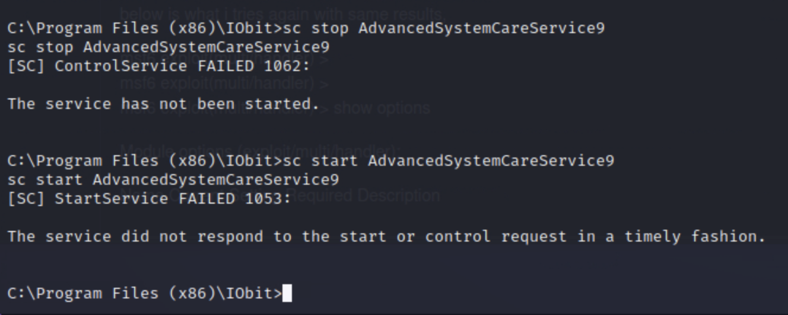

# Steel Mountain

Write-up on CTF from tryhackme.

There are two ways to gain system access, in this writeup, I will be covering only the first one, which uses `msfconsole`.

Note also that my kali machine crashed so that is why the attacker IP changes midway through the write-up.

##  Introduction

### Who is the employee of the month?

I started by opening the web page.


Then I right clicked and looked at the source code.


Bill Harper

##  Initial Access

### Scan the machine with nmap. What is the other port running a web server on?

```
┌──(root㉿kali)-[~]
└─# nmap -sC -sV -O 10.10.221.110
Starting Nmap 7.93 ( https://nmap.org ) at 2023-08-12 17:25 UTC
Stats: 0:01:21 elapsed; 0 hosts completed (1 up), 1 undergoing Script Scan
NSE Timing: About 98.22% done; ETC: 17:27 (0:00:00 remaining)
Nmap scan report for ip-10-10-221-110.eu-west-1.compute.internal (10.10.221.110)
Host is up (0.00048s latency).
Not shown: 989 closed tcp ports (reset)
PORT      STATE SERVICE            VERSION
80/tcp    open  http               Microsoft IIS httpd 8.5
| http-methods: 
|_  Potentially risky methods: TRACE
|_http-server-header: Microsoft-IIS/8.5
|_http-title: Site doesn't have a title (text/html).
135/tcp   open  msrpc              Microsoft Windows RPC
139/tcp   open  netbios-ssn        Microsoft Windows netbios-ssn
445/tcp   open  microsoft-ds       Microsoft Windows Server 2008 R2 - 2012 microsoft-ds
3389/tcp  open  ssl/ms-wbt-server?
| rdp-ntlm-info: 
|   Target_Name: STEELMOUNTAIN
|   NetBIOS_Domain_Name: STEELMOUNTAIN
|   NetBIOS_Computer_Name: STEELMOUNTAIN
|   DNS_Domain_Name: steelmountain
|   DNS_Computer_Name: steelmountain
|   Product_Version: 6.3.9600
|_  System_Time: 2023-08-12T17:26:59+00:00
| ssl-cert: Subject: commonName=steelmountain
| Not valid before: 2023-08-11T17:18:53                                                                                                                                        
|_Not valid after:  2024-02-10T17:18:53                                                                                                                                        
|_ssl-date: 2023-08-12T17:27:05+00:00; 0s from scanner time.                                                                                                                   
8080/tcp  open  http               HttpFileServer httpd 2.3                                                                                                                    
|_http-server-header: HFS 2.3                                                                                                                                                  
|_http-title: HFS /                                                                                                                                                            
49152/tcp open  msrpc              Microsoft Windows RPC                                                                                                                       
49153/tcp open  msrpc              Microsoft Windows RPC                                                                                                                       
49154/tcp open  msrpc              Microsoft Windows RPC                                                                                                                       
49155/tcp open  msrpc              Microsoft Windows RPC                                                                                                                       
49156/tcp open  msrpc              Microsoft Windows RPC
MAC Address: 02:46:6B:AD:6D:2B (Unknown)
No exact OS matches for host (If you know what OS is running on it, see https://nmap.org/submit/ ).
TCP/IP fingerprint:
OS:SCAN(V=7.93%E=4%D=8/12%OT=80%CT=1%CU=43288%PV=Y%DS=1%DC=D%G=Y%M=02466B%T
OS:M=64D7C0E9%P=x86_64-pc-linux-gnu)SEQ(SP=100%GCD=1%ISR=10F%TI=I%CI=I%II=I
OS:%SS=S%TS=7)OPS(O1=M2301NW8ST11%O2=M2301NW8ST11%O3=M2301NW8NNT11%O4=M2301
OS:NW8ST11%O5=M2301NW8ST11%O6=M2301ST11)WIN(W1=2000%W2=2000%W3=2000%W4=2000
OS:%W5=2000%W6=2000)ECN(R=Y%DF=Y%T=80%W=2000%O=M2301NW8NNS%CC=Y%Q=)T1(R=Y%D
OS:F=Y%T=80%S=O%A=S+%F=AS%RD=0%Q=)T2(R=Y%DF=Y%T=80%W=0%S=Z%A=S%F=AR%O=%RD=0
OS:%Q=)T3(R=Y%DF=Y%T=80%W=0%S=Z%A=O%F=AR%O=%RD=0%Q=)T4(R=Y%DF=Y%T=80%W=0%S=
OS:A%A=O%F=R%O=%RD=0%Q=)T5(R=Y%DF=Y%T=80%W=0%S=Z%A=S+%F=AR%O=%RD=0%Q=)T6(R=
OS:Y%DF=Y%T=80%W=0%S=A%A=O%F=R%O=%RD=0%Q=)T7(R=Y%DF=Y%T=80%W=0%S=Z%A=S+%F=A
OS:R%O=%RD=0%Q=)U1(R=Y%DF=N%T=80%IPL=164%UN=0%RIPL=G%RID=G%RIPCK=G%RUCK=G%R
OS:UD=G)IE(R=Y%DFI=N%T=80%CD=Z)

Network Distance: 1 hop
Service Info: OSs: Windows, Windows Server 2008 R2 - 2012; CPE: cpe:/o:microsoft:windows

Host script results:
| smb2-time: 
|   date: 2023-08-12T17:26:59
|_  start_date: 2023-08-12T17:18:43
| smb2-security-mode: 
|   302: 
|_    Message signing enabled but not required
| smb-security-mode: 
|   account_used: guest
|   authentication_level: user
|   challenge_response: supported
|_  message_signing: disabled (dangerous, but default)
|_nbstat: NetBIOS name: STEELMOUNTAIN, NetBIOS user: <unknown>, NetBIOS MAC: 02466bad6d2b (unknown)

OS and Service detection performed. Please report any incorrect results at https://nmap.org/submit/ .
Nmap done: 1 IP address (1 host up) scanned in 85.90 seconds
```

The output shows that the other web server is on port 8080.

### Take a look at the other web server. What file server is running?


Clicking the link, we can read more about the server.


The file server running is Rejetto HTTP File Server.

### What is the CVE number to exploit this file server?

I began preparing `msfconsole` here. Searching for available exploits, I was able to find the CVE number using the `info` command.


The CVE number is 2014-6287.

### Use Metasploit to get an initial shell. What is the user flag?

Since I chose the exploit already, the next step was to set the options.


Running the exploit, a meterpreter shell was spawned.

 


The user flag is **b04763b6fcf51fcd7c13abc7db4fd365.**

## Privilege Escalation

To escalate, I began by using a powershell script called [powerup](https://github.com/PowerShellMafia/PowerSploit/blob/master/Privesc/PowerUp.ps1).


Then I ran the script to enumerate misconfigurations that can be exploited. Note that I had already loaded powershell into the meterpreter shell, but I wanted to document that this is a necessary step to take before the powershell script can be run.


The whole output is listed below.

```
ServiceName    : AdvancedSystemCareService9
Path           : C:\Program Files (x86)\IObit\Advanced SystemCare\ASCService.exe
ModifiablePath : @{ModifiablePath=C:\; IdentityReference=BUILTIN\Users; Permissions=AppendData/AddSubdirectory}
StartName      : LocalSystem
AbuseFunction  : Write-ServiceBinary -Name 'AdvancedSystemCareService9' -Path <HijackPath>
CanRestart     : True
Name           : AdvancedSystemCareService9
Check          : Unquoted Service Paths

ServiceName    : AdvancedSystemCareService9
Path           : C:\Program Files (x86)\IObit\Advanced SystemCare\ASCService.exe
ModifiablePath : @{ModifiablePath=C:\; IdentityReference=BUILTIN\Users; Permissions=WriteData/AddFile}
StartName      : LocalSystem
AbuseFunction  : Write-ServiceBinary -Name 'AdvancedSystemCareService9' -Path <HijackPath>
CanRestart     : True
Name           : AdvancedSystemCareService9
Check          : Unquoted Service Paths

ServiceName    : AdvancedSystemCareService9
Path           : C:\Program Files (x86)\IObit\Advanced SystemCare\ASCService.exe
ModifiablePath : @{ModifiablePath=C:\Program Files (x86)\IObit; IdentityReference=STEELMOUNTAIN\bill;
                 Permissions=System.Object[]}
StartName      : LocalSystem
AbuseFunction  : Write-ServiceBinary -Name 'AdvancedSystemCareService9' -Path <HijackPath>
CanRestart     : True
Name           : AdvancedSystemCareService9
Check          : Unquoted Service Paths

ServiceName    : AdvancedSystemCareService9
Path           : C:\Program Files (x86)\IObit\Advanced SystemCare\ASCService.exe
ModifiablePath : @{ModifiablePath=C:\Program Files (x86)\IObit\Advanced SystemCare\ASCService.exe;
                 IdentityReference=STEELMOUNTAIN\bill; Permissions=System.Object[]}
StartName      : LocalSystem
AbuseFunction  : Write-ServiceBinary -Name 'AdvancedSystemCareService9' -Path <HijackPath>
CanRestart     : True
Name           : AdvancedSystemCareService9
Check          : Unquoted Service Paths

ServiceName    : AWSLiteAgent
Path           : C:\Program Files\Amazon\XenTools\LiteAgent.exe
ModifiablePath : @{ModifiablePath=C:\; IdentityReference=BUILTIN\Users; Permissions=AppendData/AddSubdirectory}
StartName      : LocalSystem
AbuseFunction  : Write-ServiceBinary -Name 'AWSLiteAgent' -Path <HijackPath>
CanRestart     : False
Name           : AWSLiteAgent
Check          : Unquoted Service Paths

ServiceName    : AWSLiteAgent
Path           : C:\Program Files\Amazon\XenTools\LiteAgent.exe
ModifiablePath : @{ModifiablePath=C:\; IdentityReference=BUILTIN\Users; Permissions=WriteData/AddFile}
StartName      : LocalSystem
AbuseFunction  : Write-ServiceBinary -Name 'AWSLiteAgent' -Path <HijackPath>
CanRestart     : False
Name           : AWSLiteAgent
Check          : Unquoted Service Paths

ServiceName    : IObitUnSvr
Path           : C:\Program Files (x86)\IObit\IObit Uninstaller\IUService.exe
ModifiablePath : @{ModifiablePath=C:\; IdentityReference=BUILTIN\Users; Permissions=AppendData/AddSubdirectory}
StartName      : LocalSystem
AbuseFunction  : Write-ServiceBinary -Name 'IObitUnSvr' -Path <HijackPath>
CanRestart     : False
Name           : IObitUnSvr
Check          : Unquoted Service Paths

ServiceName    : IObitUnSvr
Path           : C:\Program Files (x86)\IObit\IObit Uninstaller\IUService.exe
ModifiablePath : @{ModifiablePath=C:\; IdentityReference=BUILTIN\Users; Permissions=WriteData/AddFile}
StartName      : LocalSystem
AbuseFunction  : Write-ServiceBinary -Name 'IObitUnSvr' -Path <HijackPath>
CanRestart     : False
Name           : IObitUnSvr
Check          : Unquoted Service Paths

ServiceName    : IObitUnSvr
Path           : C:\Program Files (x86)\IObit\IObit Uninstaller\IUService.exe
ModifiablePath : @{ModifiablePath=C:\Program Files (x86)\IObit; IdentityReference=STEELMOUNTAIN\bill;
                 Permissions=System.Object[]}
StartName      : LocalSystem
AbuseFunction  : Write-ServiceBinary -Name 'IObitUnSvr' -Path <HijackPath>
CanRestart     : False
Name           : IObitUnSvr
Check          : Unquoted Service Paths

ServiceName    : IObitUnSvr
Path           : C:\Program Files (x86)\IObit\IObit Uninstaller\IUService.exe
ModifiablePath : @{ModifiablePath=C:\Program Files (x86)\IObit\IObit Uninstaller\IUService.exe;
                 IdentityReference=STEELMOUNTAIN\bill; Permissions=System.Object[]}
StartName      : LocalSystem
AbuseFunction  : Write-ServiceBinary -Name 'IObitUnSvr' -Path <HijackPath>
CanRestart     : False
Name           : IObitUnSvr
Check          : Unquoted Service Paths

ServiceName    : LiveUpdateSvc
Path           : C:\Program Files (x86)\IObit\LiveUpdate\LiveUpdate.exe
ModifiablePath : @{ModifiablePath=C:\; IdentityReference=BUILTIN\Users; Permissions=AppendData/AddSubdirectory}
StartName      : LocalSystem
AbuseFunction  : Write-ServiceBinary -Name 'LiveUpdateSvc' -Path <HijackPath>
CanRestart     : False
Name           : LiveUpdateSvc
Check          : Unquoted Service Paths

ServiceName    : LiveUpdateSvc
Path           : C:\Program Files (x86)\IObit\LiveUpdate\LiveUpdate.exe
ModifiablePath : @{ModifiablePath=C:\; IdentityReference=BUILTIN\Users; Permissions=WriteData/AddFile}
StartName      : LocalSystem
AbuseFunction  : Write-ServiceBinary -Name 'LiveUpdateSvc' -Path <HijackPath>
CanRestart     : False
Name           : LiveUpdateSvc
Check          : Unquoted Service Paths

ServiceName    : LiveUpdateSvc
Path           : C:\Program Files (x86)\IObit\LiveUpdate\LiveUpdate.exe
ModifiablePath : @{ModifiablePath=C:\Program Files (x86)\IObit\LiveUpdate\LiveUpdate.exe;
                 IdentityReference=STEELMOUNTAIN\bill; Permissions=System.Object[]}
StartName      : LocalSystem
AbuseFunction  : Write-ServiceBinary -Name 'LiveUpdateSvc' -Path <HijackPath>
CanRestart     : False
Name           : LiveUpdateSvc
Check          : Unquoted Service Paths

ServiceName                     : AdvancedSystemCareService9
Path                            : C:\Program Files (x86)\IObit\Advanced SystemCare\ASCService.exe
ModifiableFile                  : C:\Program Files (x86)\IObit\Advanced SystemCare\ASCService.exe
ModifiableFilePermissions       : {WriteAttributes, Synchronize, ReadControl, ReadData/ListDirectory...}
ModifiableFileIdentityReference : STEELMOUNTAIN\bill
StartName                       : LocalSystem
AbuseFunction                   : Install-ServiceBinary -Name 'AdvancedSystemCareService9'
CanRestart                      : True
Name                            : AdvancedSystemCareService9
Check                           : Modifiable Service Files

ServiceName                     : IObitUnSvr
Path                            : C:\Program Files (x86)\IObit\IObit Uninstaller\IUService.exe
ModifiableFile                  : C:\Program Files (x86)\IObit\IObit Uninstaller\IUService.exe
ModifiableFilePermissions       : {WriteAttributes, Synchronize, ReadControl, ReadData/ListDirectory...}
ModifiableFileIdentityReference : STEELMOUNTAIN\bill
StartName                       : LocalSystem
AbuseFunction                   : Install-ServiceBinary -Name 'IObitUnSvr'
CanRestart                      : False
Name                            : IObitUnSvr
Check                           : Modifiable Service Files

ServiceName                     : LiveUpdateSvc
Path                            : C:\Program Files (x86)\IObit\LiveUpdate\LiveUpdate.exe
ModifiableFile                  : C:\Program Files (x86)\IObit\LiveUpdate\LiveUpdate.exe
ModifiableFilePermissions       : {WriteAttributes, Synchronize, ReadControl, ReadData/ListDirectory...}
ModifiableFileIdentityReference : STEELMOUNTAIN\bill
StartName                       : LocalSystem
AbuseFunction                   : Install-ServiceBinary -Name 'LiveUpdateSvc'
CanRestart                      : False
Name                            : LiveUpdateSvc
Check                           : Modifiable Service Files
```

### Take close attention to the CanRestart option that is set to true. What is the name of the service which shows up as an unquoted service path vulnerability?


AdvancedSystemCareService9 sticks out because it can be restarted, has an [unquoted service path](https://medium.com/@SumitVerma101/windows-privilege-escalation-part-1-unquoted-service-path-c7a011a8d8ae), and runs as LocalSystem. 

### What is the root flag?

To exploit this, I start a listener, upload a payload into the service path, and restart the service.

Here I opened the listener:


I then generated a payload called `Advanced.exe`. When `AdvancedSystemCareService9` restarts, Windows will check if there is a file called `Advanced.exe` before it is able to reach `ASCService.exe`. 


Then I made sure to upload `Advanced.exe` into the same directory as `Advanced SystemCare` so it will be executed. 


I opened a cmd shell within meterpreter by running `shell`. Then I stopped and started the service.



Finally the listener opens a shell with system level privileges.


The root flag is **9af5f314f57607c00fd09803a587db80**